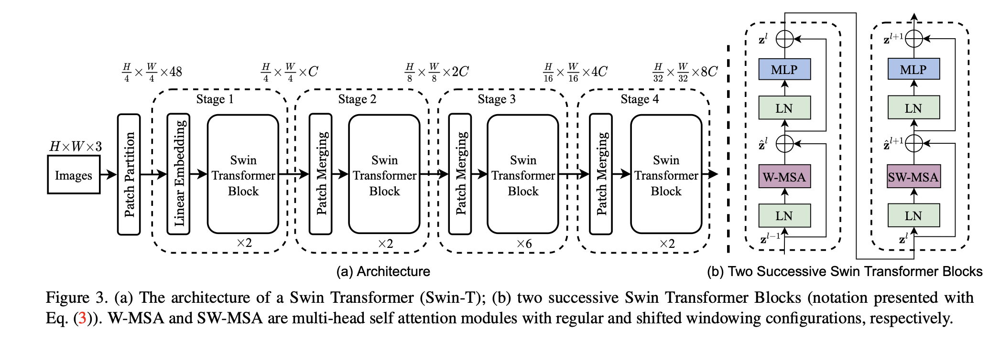

# SwinViT for Visual Sudoku Classification

## Highlights

</img>

This repository contains the implementation of a Swin Transformer-based architecture for Visual Sudoku classification. It has been modified from another SwinViT repository to handle the task of classifying visual Sudoku puzzles.

**Swin Transformer** (the name `Swin` stands for **S**hifted **win**dow) is initially described in [arxiv](https://arxiv.org/abs/2103.14030), which capably serves as a general-purpose backbone for computer vision. It is basically a hierarchical Transformer whose representation is computed with shifted windows. The shifted windowing scheme brings greater efficiency by limiting self-attention computation to non-overlapping local windows while also allowing for cross-window connection.

## Project Structure

```
├── main.py
├── model
│   └── swin_vit.py
├── requirements.txt
└── utils
    ├── autoaug.py
    ├── cutmix.py
    ├── dataloader.py
    ├── loss.py
    ├── optimizer.py
    ├── parser.py
    ├── random_erasing.py
    ├── sampler.py
    ├── scheduler.py
    ├── train_functions.py
    ├── transforms.py
    └── utils.py
```

## Usage

### Install Dependencies

Create a virtual environment and clone this repository:

```bash
# Clone the repository
git clone https://github.com/jordandeklerk/SwinViT.git
cd SwinViT

# Create a virtual environment
python3 -m venv myenv

# Activate the virtual environment
source myenv/bin/activate

# Install the required Python packages
pip install -r requirements.txt
```

<hr>

## Usage
Run `main.py` with the following hyperparameters:

```bash
python main.py  --patch_size 4 \
                --image_size 112 \
                --in_channels 1 \
                --weight_decay 0.1 \
                --batch_size 10 \
                --epochs 200 \
                --lr 0.001 \
                --warmup_epochs 10 \
                --min_lr 1e-6 \
                --clip_grad 3.0
```
